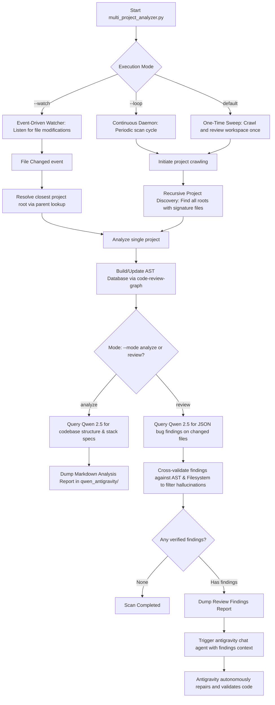

# Qwen-Antigravity Code Review & Self-Healing Pipeline

An autonomous code review and self-healing system that traverses project directories, extracts code structure and AST metadata using `code-review-graph`, uses a local Qwen model to analyze tech stacks and detect bugs, and triggers the `antigravity` CLI agent to autonomously repair issues.

---

## 🔄 Pipeline Flow Architecture



---

## ⚡ Key Features

- **Recursive Nested Scan**: Crawls all subdirectories to identify independent frontend, backend, and mobile applications nested inside monorepos or container repositories.
- **Dynamic Ignores**: Parses `.gitignore` dynamically alongside default ignores (`node_modules`, `.git`, `venv`, etc.) to prevent indexing of massive/ignored folders.
- **Stack Classification**: Automatically detects and classifies technology stacks including React Native, React, Node.js, Vite, Python, Go, Rust, and Java/Kotlin.
- **Anti-Hallucination filter**: Enforces structured JSON findings from local Qwen models and cross-references reported classes/functions/variables against the `code-review-graph` SQLite index.
- **Dynamic Self-Reloading**: Automatically monitors the analyzer script for updates. If the script is modified, it restarts itself in-flight to immediately adopt new logic or rules.

---

## 🚀 Commands & Usage

### Usage Modes

| Command | Mode | Description |
| :--- | :--- | :--- |
| `python3 multi_project_analyzer.py --base <path>` | **One-time Sweep** | Crawls the directory once, analyzes all projects, writes tech summaries, and terminates. |
| `python3 multi_project_analyzer.py --base <path> --loop --interval 300` | **Loop Daemon** | Runs indefinitely, performing a sweep of the workspace folder every 5 minutes. |
| `python3 multi_project_analyzer.py --base <path> --watch` | **Event Watcher** | Listens for file saves and triggers an immediate, targeted review/fix cycle on the active project. |

### CLI Options

| Argument | Type | Default | Description |
| :--- | :--- | :--- | :--- |
| `--base` | String | `/home/chitrarth/Chitrarth` | Base workspace path to traverse. |
| `--mode` | Choice | `analyze` | Execution task: `analyze` (codebase summaries) or `review` (bug finding & auto-fix). |
| `--loop` | Flag | `False` | Run continuously in a daemon cycle. |
| `--interval`| Integer| `300` | Wait time (in seconds) between loop cycles. |
| `--watch` | Flag | `False` | Watch base directory for real-time file saves. |

---

## 🛠️ Requirements & Setup

### 1. Install & Configure Ollama (Local LLM Server)
Ollama runs the local LLM used to analyze projects and review code:
- **Download & Install**:
  - **Linux**:
    ```bash
    curl -fsSL https://ollama.com/install.sh | sh
    ```
  - **macOS / Windows**: Download the installer from [ollama.com](https://ollama.com).
- **Start the Ollama daemon**:
  Normally Ollama runs as a background system service. If you need to run it manually:
  ```bash
  ollama serve
  ```
- **Download the Qwen 2.5 Model**:
  The orchestrator targets `qwen2.5:14b`. Pull the model using:
  ```bash
  ollama pull qwen2.5:14b
  ```

### 2. Install Code Review Graph (AST Generator)
`code-review-graph` is a CLI tool that parses code structures and indexes them into an SQLite database:
- **Install via pip**:
  ```bash
  pip install --user code-review-graph
  ```
- **Verify installation path**:
  The orchestrator expects the binary to reside at:
  `~/.local/bin/code-review-graph`

### 3. Install Python Dependencies
Install the required python packages for file watching and events:
```bash
pip install watchdog
```

### 4. Configure Antigravity CLI (Self-Healing Agent)
The self-healing workflow invokes the Antigravity agent CLI to perform autonomous code repairs:
- Ensure the `antigravity` CLI binary is installed and executable at `/usr/bin/antigravity`.
