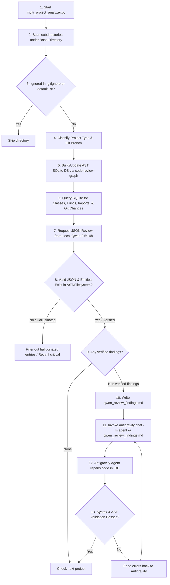

# Multi-Project Automated Code Review & Auto-Fix Loop

This plan proposes an automated master-slave task orchestration system. A master Python script traverses all projects in your workspace, extracts their structure and recent modifications via `code-review-graph` AST parsing, and invokes the slave local Qwen model to identify architectural issues, bugs, or security vulnerabilities. If Qwen finds issues, it logs them and triggers the Antigravity CLI to autonomously fix them.

## User Review Required

> [!IMPORTANT]
> The orchestrator will traverse all subdirectories under `/home/chitrarth/Chitrarth/` and automatically execute `code-review-graph build` to index them.
> **Dynamic Boundaries**: Boundaries (directories to ignore) will be determined dynamically on the fly by reading `.gitignore` files, package files, and detecting massive/non-source subfolders.
> **Hallucination Prevention**: To prevent LLM hallucinations:
> 1. We enforce structured JSON output from Qwen.
> 2. The Python script cross-validates every file and class/function signature mentioned in Qwen's findings against the actual AST database/filesystem before logging them.
> 3. Compilation/syntax check hooks run after fixes are applied.

---

## Proposed System Architecture & Flow

---

## Preventing Hallucinations (Checks & Safeguards)

To verify the validity of Qwen's findings and ensure the pipeline remains robust, we implement three checks:
1. **Strict JSON Schema Enforcement**: We query Qwen using Ollama's structured JSON response option. Qwen is forced to return a JSON array of issues containing keys: `file_path`, `entity_name` (class/function/variable name), `issue_description`, `severity`, and `suggested_fix`.
2. **AST Cross-Referencing**: Before generating the markdown findings, the master script cross-references each `file_path` and `entity_name` with the database (`graph.db`) and files. If a file does not exist, or the entity is not found in the file, the finding is discarded as a hallucination.
3. **Post-Fix Compilation/Linter Checks**: After Antigravity executes its edit/fix cycle, the script runs compilation or syntax checks (e.g., `python -m py_compile` for Python, `npm run build` or syntax parsers for JS/TS) to verify the changes did not break the project.

---

## Proposed Changes

### Workspace Scripts

#### [NEW] [multi_project_analyzer.py](file:///home/chitrarth/Chitrarth/Project%20P/qwen_antigravity/multi_project_analyzer.py)
A Python utility that automatically crawls multiple project directories, extracts AST structures, runs local Qwen reviews, filters hallucinations, and triggers Antigravity chat agents.

#### [MODIFY] [walkthrough.md](file:///home/chitrarth/Chitrarth/Project%20P/qwen_antigravity/walkthrough.md)
Update user guides to explain how to run the multi-project automated loop.

---

## Verification Plan

### Automated Tests
- Create a mockup/temporary project containing syntax or logical issues and a `.gitignore` containing custom exclusion patterns.
- Run `python3 multi_project_analyzer.py --base /home/chitrarth/Chitrarth/Project P/qwen_antigravity/scratch/test_project` to verify:
  1. Project root is detected.
  2. Custom `.gitignore` directories are dynamically excluded.
  3. AST db is generated.
  4. Qwen identifies issues and writes findings.
  5. Antigravity chat is successfully triggered with a prompt instructing it to utilize web search if needed.

### Manual Verification
- Run the full pipeline in daemon mode on selected workspaces and observe the autonomous Antigravity agents correcting issues.
