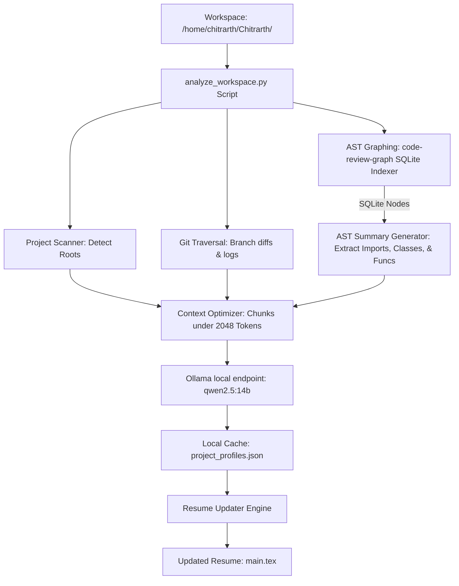

# 🛠️ Local Qwen Workspace Analyzer & Resume Updater

This documentation explains how we will leverage your local Ollama model (`qwen2.5:14b`) alongside **`code-review-graph`** to scan, analyze, and build a unified directory map of all projects under `/home/chitrarth/Chitrarth/`—and use that knowledge to automatically keep your professional resume updated.

---

## 🎯 Architecture Diagram



---

## 🚀 1. Core Integration of `code-review-graph`

`code-review-graph` builds a persistent, incremental knowledge graph of codebases using Tree-sitter. It parses 23 languages and stores structural relationships (functions, classes, imports, and file dependencies) in a local SQLite database.

### Why it solves the 2048-Token Context Limit:
Instead of sending raw source code files to the LLM (which would immediately exceed the 2048-token context limit), we let `code-review-graph` index the repository into a SQLite file. Our script then queries SQLite to extract:
1.  **High-Level File Dependencies:** Which files import which components.
2.  **Structural Interfaces:** Function signatures and class outlines without the heavy implementation code.
3.  **Blast Radius / Changed Files:** Only the files modified in active git branches, ignoring unchanged code.
We then feed this pre-filtered, structured semantic mapping to Qwen, keeping prompt sizes under **1,000 tokens** while retaining full architectural context.

### Virtual Environment Setup
Since Python 3.14 manages system packages strictly, we install the tool inside a dedicated local virtual environment:
```bash
# 1. Create a local venv for the analyzer
python3 -m venv /home/chitrarth/Chitrarth/temp/venv_analyzer

# 2. Activate the virtual environment
source /home/chitrarth/Chitrarth/temp/venv_analyzer/bin/activate

# 3. Install code-review-graph
pip install code-review-graph
```

---

## 📋 2. Step-by-Step Workspace Analysis Workflow

For each project in `/home/chitrarth/Chitrarth/`:

### Step 1: Initialize AST Graphing
Our Python script activates the environment and runs:
```bash
code-review-graph build
```
This parses all source files in the project root and creates a local SQLite database file containing the code graph.

### Step 2: Extract Graph Structure
The Python script queries the SQLite database directly (or uses `code-review-graph` query utilities) to extract:
*   The list of major classes and exports.
*   The import dependencies of files modified in the active git branch.

### Step 3: Git Digesting
Run:
*   `git branch -a` to get the list of branches.
*   `git log --oneline -n 5` to get recent commits on the active branch.
*   `git diff main..branch_name --stat` to get a list of changed files.

### Step 4: Local Qwen Analysis & Caching
The script feeds the structured AST layout and git logs to `qwen2.5:14b` with a concise prompt. Qwen returns a high-quality summary of the project's architecture, technologies, and achievements.

The script aggregates these into `/home/chitrarth/.gemini/antigravity/brain/d5ba95fc-afa3-4dd9-8b3c-e8b855361c21/scratch/project_profiles.json`.

### Step 5: Resume Update
Using the cached profiles, we update your resume sections in `/home/chitrarth/Chitrarth/Project P/overleaf/main.tex`, ensuring perfect technical alignment with the active code.
